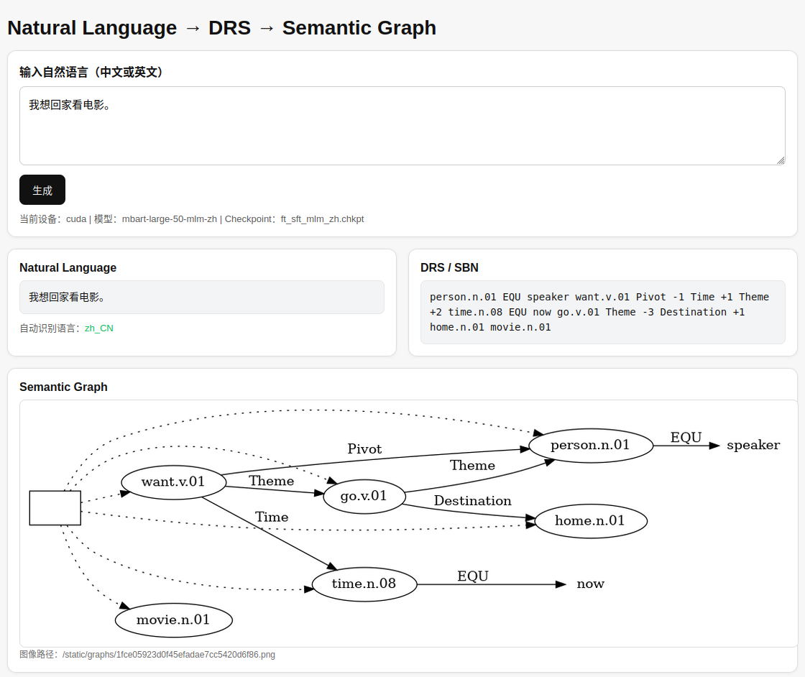

Chinese / English → DRS → Semantic Graph
Overview

This project builds a semantic parsing system based on mBART.

It supports:

Natural Language (Chinese or English) → DRS (SBN format)
DRS → Semantic Graph
Web-based visualization

The current focus is Chinese semantic parsing, while English is also supported.

What it does

Input a sentence:

我想回家看电影。

or

I want to go home and watch a movie.

The system will generate:

DRS (semantic structure)
A semantic graph (visualized in the browser)
Installation
pip install -r requirements.txt
Model Setup (Required)

Model files are not included due to size.

You need:

mbart-large-50-mlm-zh/        # model directory
ft_sft_mlm_zh.chkpt           # fine-tuned checkpoint
Recommended setup

Edit paths in web_app.py:

MODEL_DIR = Path("/your/path/to/mbart-large-50-mlm-zh")
CKPT_PATH = Path("/your/path/to/ft_sft_mlm_zh.chkpt")
Run Web Demo
python web_app.py

Then open:

http://127.0.0.1:7860
Example

Input:

我想回家看电影。

Output:

DRS (SBN)
Semantic graph (PNG)
## Demo

  

Project Structure
drs-zh-semantic-parser/
├── web_app.py          # Web demo (main entry)
├── inference.py        # Inference script
├── tokenization_mlm.py # Custom tokenizer
│
├── utils/              # Dataset & helpers
├── evaluation/         # Smatch & graph tools
│
├── data/sample/        # Example data
├── models/             # (not included)
│
├── requirements.txt
└── README.md
Notes
Custom tokenizer with <drs> token
Built on mBART-50
Main direction: zh_CN → DRS
Supports both Chinese and English input
Author

This project was independently developed, including:

Model training (BPT / SPT / SFT)
Tokenizer extension
Chinese semantic parsing optimization
DRS → graph visualization
Web demo deployment